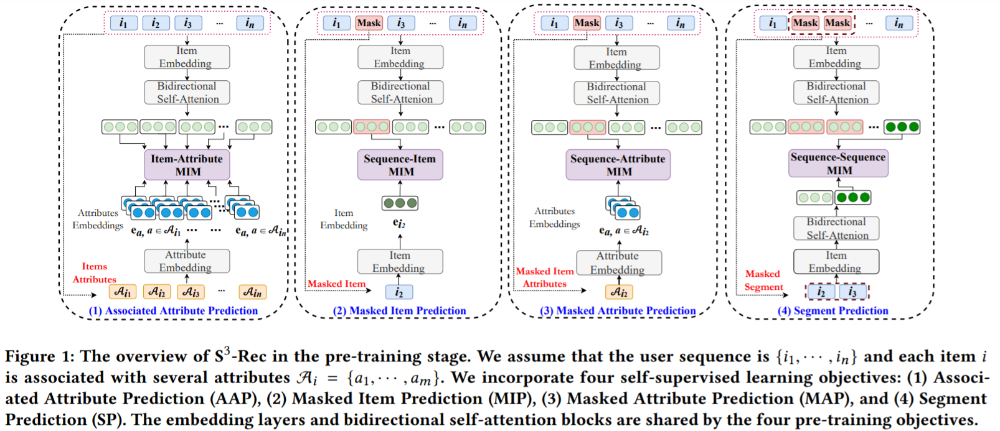
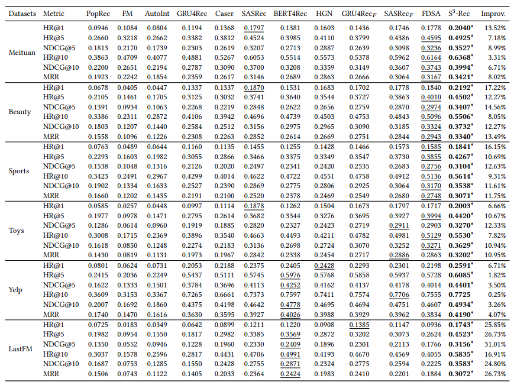
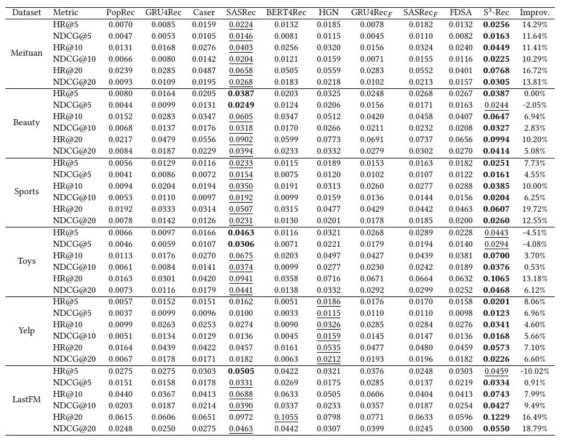

Code for our CIKM 2020 Paper ["**S3-Rec: Self-Supervised Learning for Sequential
 Recommendation with Mutual Information Maximization"**](https://arxiv.org/pdf/2008.07873.pdf)

## Overview


## Reproduce
Please check the ./reproduce/ directory.

## Results
Performance comparison of different methods on six datasets. The best performance and the second best performance
methods are denoted in bold and underlined fonts respectively.

In the PAPER, we pair the ground-truth item 
with **99 randomly sampled negative items** that the user
has not interacted with, and report the results of 
HR@{1, 5, 10}, NDCG@{5, 10} and MRR. The used test files are name as 
```
data-name_sample.txt
```
The results are shown in the following pic.



We alse rank the ground-truth item with **all the items**.
We omit the FM and AutoInt because they need 
enumerate all user-item pairs, which take a very long time. 

The results are shown in the following pic.




### requirements
```shell script
pip install -r requirements.txt
```

## data format
```shell script
data preprocess
./data/data_process.py

generate negative items for testing
./data/generate_test.py


data-name.txt
one user per line
user_1 item_1 item_2 ...
user_2 item_1 item_2 ...

data-name_sample.txt
one user per line
user_1 neg_item_1 neg_item_2 ...
user_2 neg_item_1 neg_item_2 ...

data-name_item2attributes.json
{item_1:[attr, ...], item_2:[attr, ...], ... }
```

## pretrain
```shell script
python run_pretrain.py \
--data_name data_name
```

## finetune
We support two evaluation methods. For more details, please check the ./reproduce directory.

+ Rank ground-truth item with 99 randomly sampled negative items
```shell script
python run_finetune_sample.py \
--data_name data_name \
--ckp pretrain_epochs_num
```

+ Rank the ground-truth item with all the items
```shell script
python run_finetune_full.py \
--data_name data_name \
--ckp pretrain_epochs_num
```


### Cite
If you find the our codes and datasets useful for your research or development, please cite our paper:

```
@inproceedings{DBLP:conf/cikm/ZhouWZZWZWW20,
  author    = {Kun Zhou and
               Hui Wang and
               Wayne Xin Zhao and
               Yutao Zhu and
               Sirui Wang and
               Fuzheng Zhang and
               Zhongyuan Wang and
               Ji{-}Rong Wen},
  title     = {S3-Rec: Self-Supervised Learning for Sequential Recommendation with
               Mutual Information Maximization},
  booktitle = {{CIKM} '20: The 29th {ACM} International Conference on Information
               and Knowledge Management, Virtual Event, Ireland, October 19-23, 2020},
  pages     = {1893--1902},
  publisher = {{ACM}},
  year      = {2020}
}
```

### Contact
If you have any question for our paper or codes, please send email to hui.wang@ruc.edu.cn.